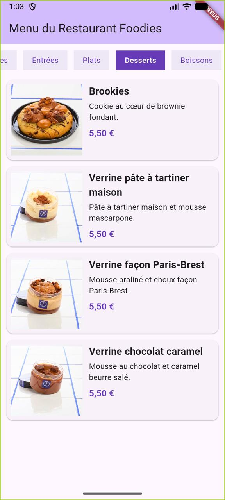
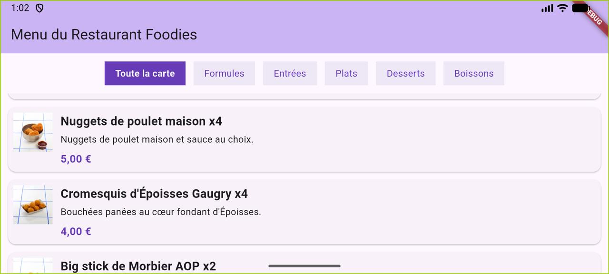

# Menu du Restaurant Foodies

Une petite application Flutter qui reprend la carte du restaurant Dijonnais Foodies (à mes yeux le meilleur restaurant au monde, bien meilleur que vos bouchons Lyonnais 😂)

On choisit une catégorie dans la barre en haut (formules, entrées, plats, desserts, boissons, ou toute la carte d'un coup) et les plats correspondants s'affichent en dessous, chacun avec sa photo, une courte description et son prix.

L'application fonctionne en portrait comme en paysage : en paysage, les images rétrécissent pour qu'on voie plus de plats à l'écran.

